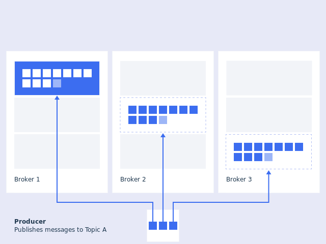
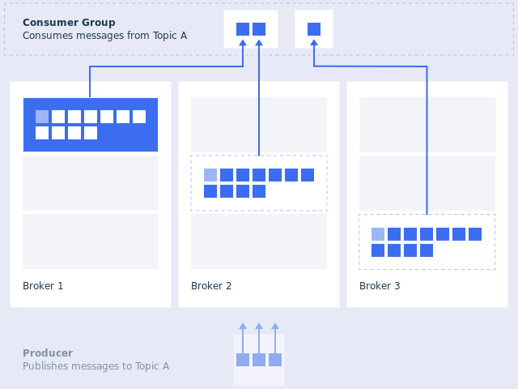

---

copyright:
  years: 2015, 2023
lastupdated: "2023-07-14"

keywords: kafka concepts, brokers, messages, topics, partitions, replication, replica, producer, consumer, consumer group

subcollection: EventStreams

---

{{site.data.keyword.attribute-definition-list}}

# Learning Apache Kafka concepts
{: #apache_kafka}

Apache Kafka is a distributed streaming platform used by many companies for numerous batch workloads, as well as real-time data integration, and data streaming use cases.
{: shortdesc}

{: caption="Figure 1. The diagram shows a Kafka architecture." caption-side="bottom"}

The following list defines some Apache Kafka concepts:

## Brokers
{: #kafka_brokers}

Apache Kafka is a distributed messaging system. A Kafka cluster consists of a set of brokers. A cluster has a minimum of three brokers.

{: caption="Figure 2. Diagram that shows an example broker." caption-side="bottom"}

## Messages
{: #kafka_messages}

A message is a unit of data in Kafka. Each message is represented as a record, which comprises two parts: key and value. The key is commonly used for data about the message and the value is the body of the message. Kafka uses the terms record and message interchangeably. 

## Topics and partitions
{: #kafka_topics_partitions}

Each topic is a named stream of messages. A topic is made up of one or more partitions. The messages on a partition are ordered by a number that is called the offset. With multiple partitions distributed across the brokers, the scalability of a topic is increased.

If a topic has more than one partition, it allows data to be fed through in parallel to increase throughput by distributing the partitions across the cluster. The number of partitions also influences the balancing of workload among consumers.

For more information, see [Partition leadership](/docs/EventStreams?topic=EventStreams-partition_leadership#partition_leadership).

{: caption="Figure 3. The diagram shows one topic with three partitions that are spread across three brokers." caption-side="bottom"}

## Replication
{: #kafka_replication}

To improve availability, each topic can be replicated onto multiple brokers. For each partition, one of the brokers is the leader, and the other brokers are the followers.

Replication works by the followers repeatedly fetching messages from the leader.

{: caption="Figure 4. The diagram shows a topic partition that is replicated across three brokers." caption-side="bottom"}

## In-sync replicas
{: #kafka_isr}

A follower replica that is keeping up with the partition leader is in-sync. Any follower with an in-sync replica can become the leader without losing any messages.

If the partition leader fails, another leader is chosen from the followers. All the replicas are to be usually in-sync. It is acceptable for a replica to be temporarily not in-sync while it is catching up after a failure.

{: caption="Figure 5. The diagram shows a topic partition that is replicated across three brokers and staying in-sync across all replicas." caption-side="bottom"}

## Producers
{: #kafka_producers}

A producer publishes messages to one or more topics. A producer can publish to one or more topics and can optionally choose the partition that stores the data.

You can also configure your producer to prioritize speed or reliability by choosing the level of acknowledgment the producer receives for messages it publishes.

For more information, see [Producing messages](/docs/EventStreams?topic=EventStreams-producing_messages#producing_messages).

{: caption="Figure 6. The diagram shows a producer publishing messages to one topic across three brokers." caption-side="bottom"}

## Consumers
{: #kafka_consumers}

A consumer reads messages from one or more topics and processes them. The difference between a consumer's current position and the newest message on a partition is known as the offset lag.

If the lag increases over time, it is a sign that the consumer is not able to keep up. Over the short term, this is not an issue but eventually the consumer might miss messages if the retention period is exceeded.

For more information, see [Consuming messages](/docs/EventStreams?topic=EventStreams-consuming_messages#consuming_messages).

{: caption="Figure 7. The diagram shows a consumer processing messages from one topic across three brokers." caption-side="bottom"}

## Consumer groups
{: #kafka_consumer_groups}

A consumer group contains one or more consumers that work together to process the messages. The messages from a single partition are processed by one consumer in each group.

At any time, each partition is assigned to only one consumer in the group. This assignment ensures that the messages on each partition are processed in order.

If more partitions than consumers exist in a group, some consumers have multiple partitions. If more consumers than partitions exist, some consumers have no partitions.

{: caption="Figure 8. The diagram shows a consumer processing messages from one topic across three brokers." caption-side="bottom"}

## More information
{: #kafka_information}

For more information, see [Apache Kafka documentation](http://kafka.apache.org/documentation.html){: external}.
