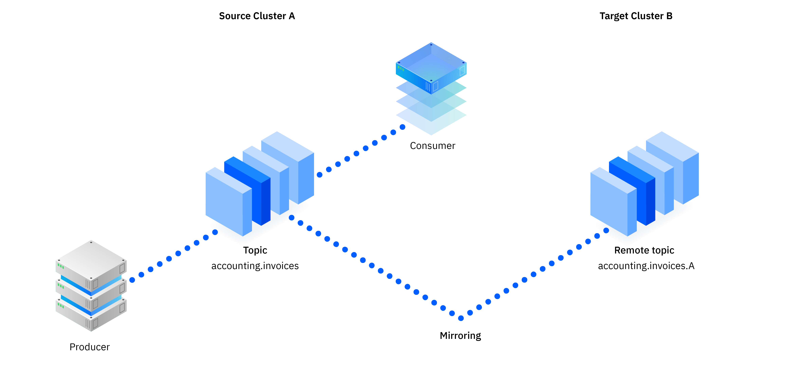
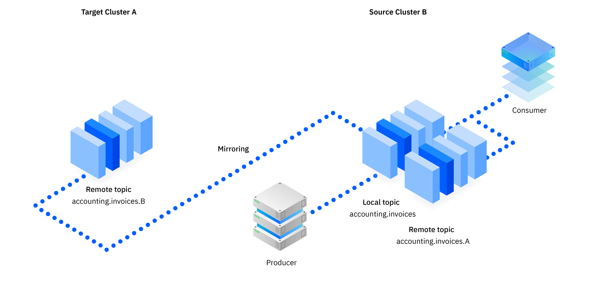
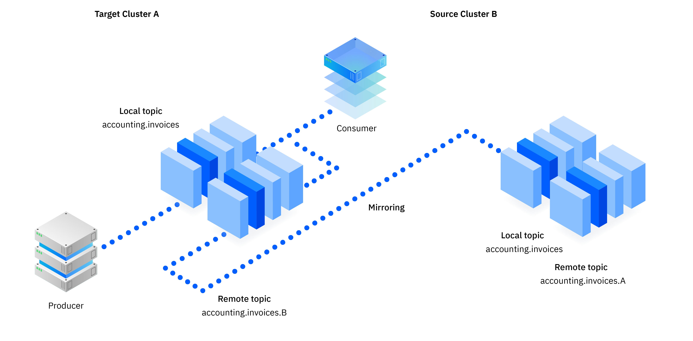

---

copyright:
  years: 2015, 2023
lastupdated: "2023-09-28"

keywords: replication, failover, scenario, disaster recovery, mirroring, failing over, failback, source cluster, mirroring

subcollection: EventStreams

---

{{site.data.keyword.attribute-definition-list}}

# Using mirroring in a disaster recovery example scenario 
{: #disaster_recovery_scenario}

This end-to-end disaster recovery scenario demonstrates how to use mirroring to provide increased availability and keep applications working in a major incident that affects a full region.
{: shortdesc}

Two clusters were provisioned in different regions and configured for mirroring (following the information in [Mirroring setup guide](/docs/EventStreams?topic=EventStreams-mirroring_setup)) by using A and B as cluster aliases. A producer publishes records to a topic called `accounting.invoices` and a consumer reads the messages from that topic in cluster A.

{: caption="Figure 1. Mirroring overview" caption-side="bottom"}

## Source cluster becomes unavailable 
{: #source_cluster_unavailable}

Let's consider what happens if a disaster occurs on the source cluster's region.

{: caption="Figure 2. Disaster in source cluster's region" caption-side="bottom"}

It is the responsibility of the {{site.data.keyword.messagehub}} instance owner to determine whether the impact of the event is such as to declare a disaster. The service instance owner must coordinate the failover of applications including their reconfiguration, redeployment, and restart if necessary.

## Failing over producers 
{: #fail_over_producers}

Perform the following steps to fail over:

1. Stop the producers that were pointing to cluster A.
2. Restart the producers that were pointing to cluster B's endpoints.
3. If cluster A and the link from A to cluster B is still operational, ensure that all data was mirrored by checking that the lag on those topics on cluster B is zero.
4. Disable any mirroring that is still enabled on topics from cluster A to cluster B. This can be done by using the [User controls](/docs/EventStreams?topic=EventStreams-mirroring#user_controls).

{: caption="Figure 3. Producer switched to cluster B." caption-side="bottom"}

The producer is now switched to cluster B and sends messages to a new local topic with the same name as the original.

## Failing over consumers
{: #fail_over_consumers}

Perform the following steps to fail over:

1. Stop the consumers that were pointing to cluster A.
2. Restart the consumers to point to cluster B's endpoints.

{: caption="Figure 4. The consumer continues to consume the existing messages." caption-side="bottom"}

The consumer is now able to continue to consume the existing messages from the `accounting.invoices.A` topic from cluster B while new messages come from `accounting.invoices`.

If the application requires strict ordering, remote topics are to be fully consumed first before starting to consume from local topics. This way, messages are processed in the order that they were produced.
{:note: .note}

## Resetting a mirroring environment
{: #reset_mirroring}

At that point, the {{site.data.keyword.messagehub}} service instance owner is responsible for deciding what happens when cluster A is recovered. 

In case cluster A is not recoverable, the {{site.data.keyword.messagehub}} service instance owner is responsible for enabling mirroring between cluster B and a newly provisioned instance. To enable mirroring to a new instance, complete the following steps:

- Fail over the producers and consumers from A to B as described previously.
- Raise a support ticket to request disabling of the current mirroring from cluster A to cluster B.
- After the support ticket has been processed, enable mirroring between cluster B (now the source) to the newly provisioned cluster (the target). See [Mirroring setup](/docs/EventStreams?topic=EventStreams-mirroring_setup) for further details.

Alternatively, if cluster A has recovered, typically a user returns operations to cluster A. Complete the following steps to return primary operations to cluster A.

Before failing back, mirroring must be enabled in the opposite direction:

- Ensure that cluster A is fully operational.
- Raise a support ticket to request disabling of the current mirroring from cluster A to cluster B.
- After the support ticket has been processed, enable mirroring between cluster B (now the source) and cluster A (now the target). See [Mirroring setup](/docs/EventStreams?topic=EventStreams-mirroring_setup) for further details.
- The source cluster A now becomes the target cluster.
- The target cluster B becomes the new source cluster.
- Enable any topics to be mirrored from cluster B to cluster A. You can do this by using the [User controls](/docs/EventStreams?topic=EventStreams-mirroring#user_controls).
  
Next, make sure that data is being replicated into cluster A by examining the topics from cluster B appearing on cluster A. These topics have the suffix from the new source cluster, B.

{: caption="Figure 5. Mirroring enabled in opposite direction." caption-side="bottom"}

Do not mirror back the original target topic on cluster B as that would cause an undesirable cyclic effect. As shown in the diagram, we mirror accounting.invoices from cluster B to cluster A, not accounting.invoices.A. 
{:note: .note}

## Failback
{: #failback_decision}

The decision to fail back is again owned by the {{site.data.keyword.messagehub}} instance owner. The service instance owner must coordinate the failback of applications including their reconfiguration, redeployment, and restart if necessary.

Unlike the failover case, in this case there was no disaster on cluster B. Therefore, failback is a controlled operation and can be achieved without data loss. 

{: caption="Figure 6. Mirroring switched back to the original configuration." caption-side="bottom"}

Finally, switch the mirroring back to the original configuration, which means that cluster A is again the source and cluster B resumes as the target. 
- Ensure that cluster A and cluster B are fully operational.
- Raise a support ticket to request disabling of the current mirroring from cluster B to cluster A.
- After the support ticket has been processed, enable mirroring between cluster A (now the source) and cluster B (now the target). See [Mirroring setup](/docs/EventStreams?topic=EventStreams-mirroring_setup) for further details.
