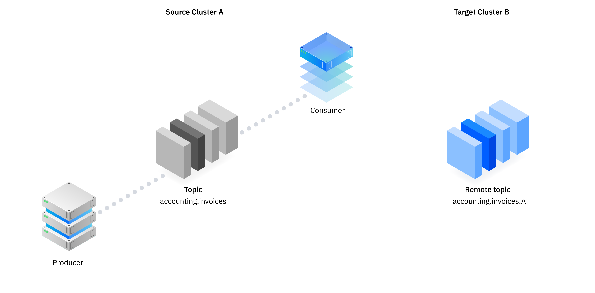
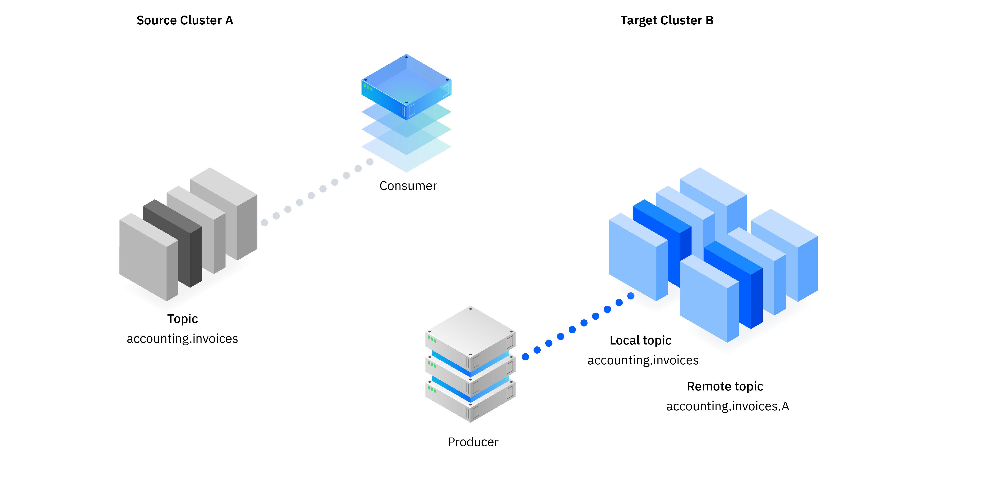

---

copyright:
  years: 2015, 2020
lastupdated: "2020-03-11"

keywords: IBM Event Streams, Kafka as a service, managed Apache Kafka, replication, failover, scenario, disaster recovery, mirroring

subcollection: EventStreams

---

{:new_window: target="_blank"}
{:shortdesc: .shortdesc}
{:screen: .screen}
{:codeblock: .codeblock}
{:pre: .pre}
{:note: .note}
{:deprecated: .deprecated}
{:important: .important}

# Disaster recovery example scenario 
{: #disaster_recovery_scenario}

Let's look at an end-to-end disaster recovery scenario. This scenario demonstrates how mirroring can be used to provide increased availability and keep applications working in case of a major incident affecting a full region. Two clusters have been provisioned in different regions and configured for mirroring (following the information in [Mirroring setup guide](/docs/EventStreams?topic=EventStreams-mirroring_setup)) using A and B as cluster aliases. 
{:shortdesc}

A producer publishes records to a topic called `accounting.invoices` and a consumer reads the messages from that topic in cluster A.

{: caption="Figure 1. Mirroring overview" caption-side="bottom"}

## Source cluster becomes unavailable 
{: #source_cluster_unavailable}

We'll now consider what happens if a disaster occurs on the source cluster's region.

{: caption="Figure 2. Disaster in source cluster's region" caption-side="bottom"}

It is the responsibility of the {{site.data.keyword.messagehub}} instance owner to determine if the impact of the event is such as to declare a disaster. The service instance owner must coordinate the failover of applications including their reconfiguration, redeployment, and restart if necessary.

## Failing over producers 
{: #fail_over_producers}

To failover:
- Stop the producers that were pointing to cluster A
- Restart the producers pointing to cluster B's endpoints
- If cluster A and the link from A to cluster B is still operational, ensure all data has been mirrored by checking the lag on those topics on cluster B is zero.
- Disable any mirroring still enabled on topics from cluster A to cluster B

{: caption="Figure 3. Producer switched to cluster B" caption-side="bottom"}

The producer is now switched to cluster B and sends messages to a new local topic with the same name as the original.

## Failing over consumers
{: #fail_over_consumers}

To fail over:
- Stop the consumers that were pointing to cluster A
- Restart the consumers to point to cluster B's endpoints

{: caption="Figure 4. The consumer continues to consume the existing messages." caption-side="bottom"}

The consumer is now able to continue consuming the existing messages from the `accounting.invoices.A` topic from cluster B while new messages come from `accounting.invoices`.

## Resetting a mirroring environment
{: #reset_mirroring}

At that point, the {{site.data.keyword.messagehub}} service instance owner is responsible for deciding what happens when cluster A has been recovered. 

In case cluster A is not recoverable, the {{site.data.keyword.messagehub}} service instance owner is responsible for enabling mirroring between cluster B and a newly provisioned instance.

Typically a user returns operations to cluster A after it has recovered. Below is the recommended way to return primary operations to cluster A.

Before failing back, mirroring has to be enabled in the opposite direction:
- Enable mirroring between cluster B (now the source) and cluster A (now the target)
- The source cluster A now becomes the target cluster.
- The target cluster B becomes the new source cluster.
- Enable any topics to be mirrored from cluster B to cluster A
  
Now make sure data is being replicated into cluster A by examining the topics from cluster B appearing on cluster A. Remember these have the suffix from the new source cluster, B.

{: caption="Figure 5. Mirroring enabled in opposite direction" caption-side="bottom"}

N.B. Do not mirror back the original target topic on cluster B as that would cause an undesirable cyclic effect. As shown in the diagram above we mirror accounting.invoices from cluster B to cluster A, not accounting.invoices.A. 

## Failback
{: #failback_decision}

The decision to fail back is again owned by the {{site.data.keyword.messagehub}} instance owner. The service instance owner must coordinate the failback of applications including their reconfiguration, redeployment, and restart if necessary.

Unlike the failover case, in this case there has been no disaster on cluster B. Therefore, failback should be a controlled operation and can be achieved without data loss. 

{: caption="Figure 6. Mirroring switched back to the original configuration." caption-side="bottom"}

Finally you should now switch the mirroring back to the original configuration, which means that cluster A is again the source and cluster B resumes as the target.
